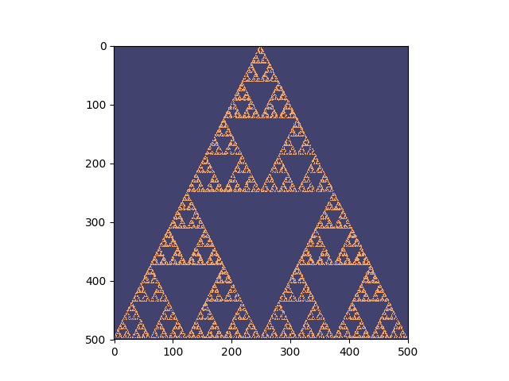
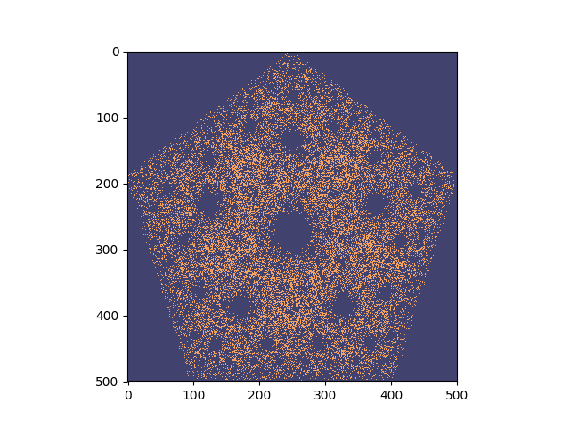
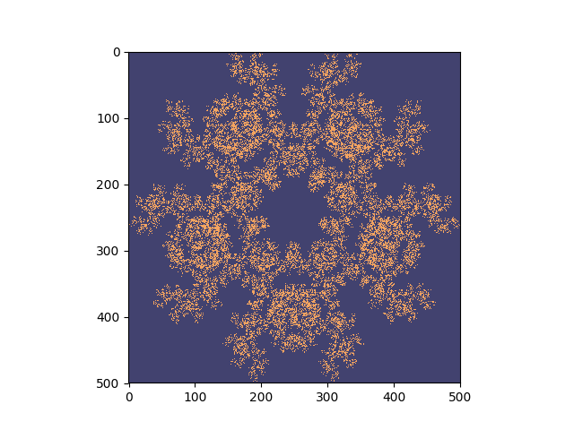
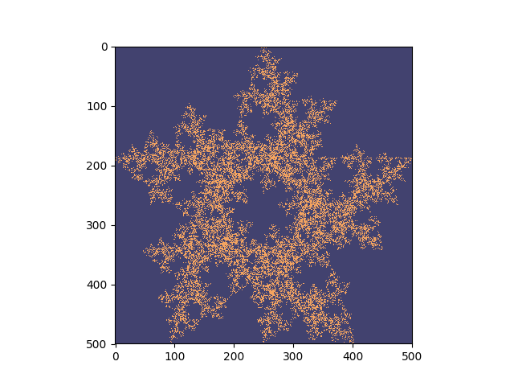

# Flam3 Generator

This Python script takes the flam3 algorithm ([paper found here](www.flam3.com/flame.pdf)) in polar coordinates to generate beautiful fractals. These fractals, such as the Sierpinski triangle, are similar to snowflakes. In the 90's these algoritms were used to generate screensavers using minimal CPU power. The algorithm cannot be parallelized.



## Installation

Just do 

```bash
python setup.py install
```

Or, if you download the wheel

```
pip install Flam3Gen-0.1-py3-none-any.whl
```


## Usage

To generate a simple Sierpinski traingle and display using Matplotlib:

```bash
python flam3.py fractal
```

For help, run `--help` to find this output:

```
$ python flam3.py fractal --help
Usage: flam3.py fractal [OPTIONS]

Options:
  -p, --point-count INTEGER RANGE
                                  Number of vertices to use to make a circle.
                                  Value in range (3,10) inclusive.
  -l, --selection-limiter TEXT    Limits the choices we can make compared to
                                  last choice
  -s, --scaling-factor FLOAT      Scales the point generator function.
  -r, --run-count INTEGER RANGE   Number of loop to run
  -d, --dry-fire INTEGER RANGE    Number of non-interactive runs to establish
                                  flam3 algorithm. Value in range (0, 10000).
  --help                          Show this message and exit.
```

### Point count

Set the number of points evenly distributed on a circle


### Scaling Factor

Scales the point generator function. Currently the default value of 2 is example an average:

```new_point = (old_point + chosen_vertex)/2```

The general formula looks like the following:

```new_point = (old_point + chosen_vertex)/scaling_factor```

### Selection limiter

This is the most complex setting. Currently this setting provides a list of boolean values that allow the algorithm to choose what vertex to choose next.

#### Example 1:

Selection limiter is 0,0,0,0,0 and point_count is 5 which perfectly recreates a pentagon-like fractal.



#### Example 2:

Selection limiter is 1,0,0,0,0 and point_count is 5. This limits the selection by never allowing the next selected vertex to be the same as the previously selected vertex.



#### Example 3:

Selection limiter is 0,1,0,0,0 and point_count is 5. This limits the selection by preventing the next vertext to be neighbors with the previously selection vertex.



## Current features

+ Generates fractals as a command line utility
+ Allows for limitless customizability
+ Graphical output with save option (via Matplotlib)
+ Partial API

## Future goals and features

+ Ability to animate
+ Ability to save to file in png, svg, or jpeg
+ Packages as both an API and command-line uility.